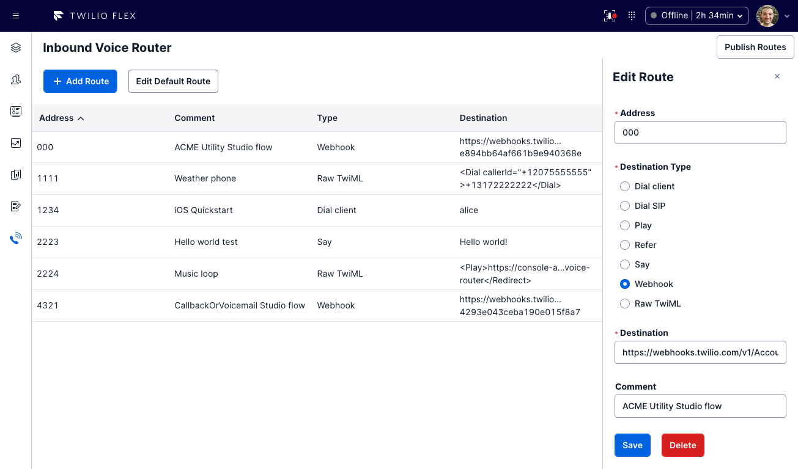
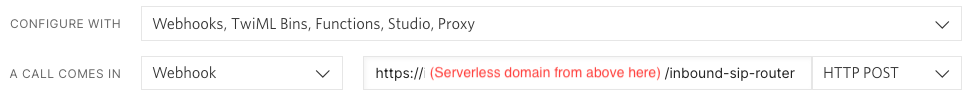

# Twilio Flex Inbound SIP Router

This solution provides a flexible, robust, and scalable way to manage inbound routes when using Twilio Flex with SIP domains.



## Disclaimer

**This software is to be considered "sample code", a Type B Deliverable, and is delivered "as-is" to the user. Twilio bears no responsibility to support the use or implementation of this software.**

## How it works

When configuring a SIP domain, you may select a single destination to redirect inbound calls to. This means that you must implement your own solution to route calls based on the address specified in the SIP `To` header. This aims to be that solution, by providing a function that can be used as the destination which will route calls based on your configuration.

To manage route configuration, a Flex plugin is provided which adds an Inbound SIP Router item to the side navigation for workers with the `admin` role. This allows viewing the current configuration and publishing updates to the configuration.

To allow for greater scalability, configuration is stored within a Twilio Asset behind a Twilio Function. When updates to the configuration are being saved, a new asset version is generated and included in a new build, which is deployed when completed. This means that publishing routes may take a few moments.

## Pre-requisites

The plugin component is designed for usage with Flex UI 2.x only.

Make sure you have [Node.js](https://nodejs.org) as well as [`npm`](https://npmjs.com) installed.

Next, please install the [Twilio CLI](https://www.twilio.com/docs/twilio-cli/quickstart). If you are using Homebrew on macOS, you can do so by running:

```bash
brew tap twilio/brew && brew install twilio
```

Finally, install the [Flex Plugin extension](https://www.twilio.com/docs/flex/developer/plugins/cli/install) and the [serverless plugin](https://www.twilio.com/docs/labs/serverless-toolkit/getting-started) for the Twilio CLI:

```bash
twilio plugins:install @twilio-labs/plugin-flex
twilio plugins:install @twilio-labs/plugin-serverless
```

## Installation

First, clone the repository and change to its directory:

```bash
git clone https://github.com/twilio-professional-services/flex-inbound-sip-router.git

cd flex-inbound-sip-router
```

Then, deploy the serverless functions:

```bash
cd serverless
npm install
twilio serverless:deploy
```

Note the domain name that is output when the deploy completes.

**Note: If you need to re-deploy via CLI in the future, be sure to first update your local `assets/config.private.json` file with any configuration changes.**

Then, update the Flex UI configuration with the serverless function domain from above:

```
POST https://flex-api.twilio.com/v1/Configuration
Authorization: Basic {base64-encoded Twilio Account SID : Auth Token}
Content-Type: application/json

{
  "account_sid": "Enter your Twilio Account SID here",
  "ui_attributes": {
    ... include your existing ui_attributes here ...
    "inbound_sip_router": {
      "serverless_functions_domain": "Enter the serverless domain here"
    }
  }
}
```

Next, switch to the Flex plugin directory:

```bash
cd ../plugin-inbound-sip-router
```

Copy `public/appConfig.example.js` to `public/appConfig.js`:

```bash
cp public/appConfig.example.js public/appConfig.js
```

Install the dependencies:

```bash
npm install
```

Run the plugin locally:

```bash
twilio flex:plugins:start
```

Once you are happy with your plugin, you have to deploy then release the plugin for it to take affect on Twilio hosted Flex.

Run the following command to start the deployment:

```bash
twilio flex:plugins:deploy --major --changelog "Notes for this version" --description "Functionality of the plugin"
```

After your deployment runs you will receive instructions for releasing your plugin from the bash prompt. You can use this or skip this step and release your plugin from the Flex plugin dashboard here https://flex.twilio.com/admin/plugins

For more details on deploying your plugin, refer to the [deploying your plugin guide](https://www.twilio.com/docs/flex/plugins#deploying-your-plugin).

The last step is to reconfigure the SIP domain to use the inbound SIP router function. In the Twilio Console, under the settings for your SIP domain, configure the Call Control Configuration section as follows:

- Configure with: `Webhooks, TwiML Bins, Functions, Studio, Proxy`
- A call comes in: Webhook, `https://(Enter the serverless domain from above here)/inbound-sip-router`, HTTP POST
- Primary handler fails: _We recommend configuring a fallback behavior of your choosing here to promote high availability._
- Call status changes: `https://(Enter the serverless domain from above here)/status-callback`, HTTP POST
  - _This is specifically important when you plan to point routes to a Studio flow, as the status callback prevents stuck executions._



## Fixing SIP addresses showing in Flex and Insights

When using SIP, you will notice that Flex and Insights will show full SIP addresses where to/from phone numbers would normally display. You can fix this by setting the following task attributes when creating a task as follows:

- `name`: Set this to the parsed caller phone number
- `conversations.external_contact`: Set this to the parsed called number
- `customers.phone`: Set this to the parsed caller phone number

If you are using Studio's "Send to Flex" widget, you can set the attributes field as follows:

```
{
  "conversations": {
    "external_contact": "{{ trigger.call.To | split:"@" | first | split:":" | last }}"
  },
  "customers": {
    "phone": "{{ trigger.call.From | split:"@" | first | split:":" | last }}"
  },
  "name": "{{ trigger.call.From | split:"@" | first | split:":" | last }}"
}
```

## Preventing conflicting configuration updates

The Flex plugin loads the configuration interface for workers with the `admin` role, of which there may be more than one. Therefore, it is a possibility that multiple people may attempt to update the configuration at the same time. To prevent workers overwriting each other's changes, a few guards have been put in place:

- When updating configuration with the `admin/update` function, the `version` property must be provided with the same `version` that was retrieved from the `admin/list` function which loaded the initial data. If this does not match, the request will fail. In the user interface, the following alert will be shown: `Routes were updated by someone else and cannot be published. Please reload and try again.` This allows the worker to rescue the changes they were attempting to make, and merge them with the changes that were saved first.
- When retrieving configuration from this `admin/list` function, a check is made that the latest build is what is deployed. The `versionIsDeployed` property is returned indicating whether this is the case. If it is not, this means another user is in the middle of publishing changes. In the user interface, the following alert will be shown: `Another route publish is in progress. Publishing now will overwrite other changes.` This allows the worker to wait for the publish to complete before making changes.

## Inclusion in a monoplugin

While it makes sense for many Flex plugins to be combined into a monoplugin such as [the Flex Project Template](https://github.com/twilio-professional-services/flex-project-template), this specific solution is recommended to be deployed as part of a separate package. This is because the entire serverless service gets re-deployed upon configuration publishes, so a monoplugin structure would result in re-deploying excessive amounts of serverless functions and assets.

## Development

Run `twilio flex:plugins --help` to see all the commands we currently support. For further details on Flex Plugins refer to our documentation on the [Twilio Docs](https://www.twilio.com/docs/flex/developer/plugins/cli) page.

